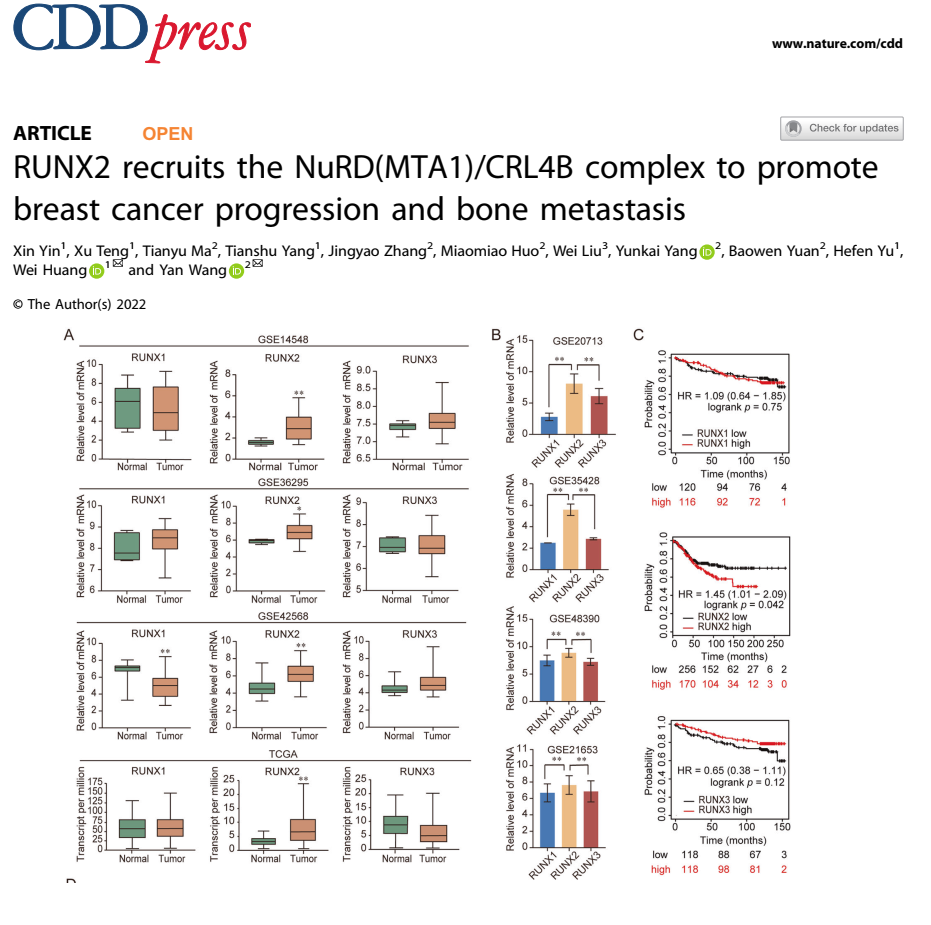
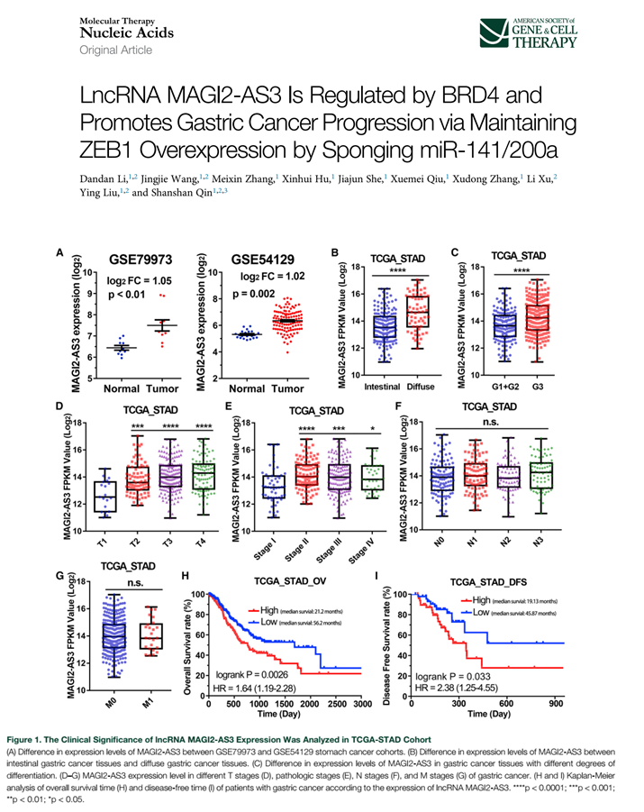

```{r setup, include=FALSE}
knitr::opts_chunk$set(echo = FALSE)
knitr::opts_chunk$set(warning = FALSE, message = FALSE) 
```

# Profiling Gene Expression from GEO, TCGA, GTEx

Before begin, it's recommended to read these publications:

+ [Analysis workflow of publicly available RNA-sequencing datasets](https://doi.org/10.1016/j.xpro.2021.100478)
+ [TCGA Workflow: Analyze cancer genomics and epigenomics data using Bioconductor packages](https://doi.org/10.12688/f1000research.8923.2)
+ [TCGAbiolinks: an R/Bioconductor package for integrative analysis of TCGA data](https://doi.org/10.1093/nar/gkv1507)
+ [New functionalities in the TCGAbiolinks package for the study and integration of cancer data from GDC and GTEx](https://doi.org/10.1371/journal.pcbi.1006701)
+ [Unifying cancer and normal RNA sequencing data from different sources](https://doi.org/10.1038/sdata.2018.61)

> We will make similar results like these :



## GEO

### Normal vs Tumor

Install and load libraries: 

```{r echo=TRUE, message=FALSE, warning=FALSE}
Sys.setenv(LANG='en') #change warning to English 
Sys.setenv("VROOM_CONNECTION_SIZE" = 131072 * 10) #prevent connection lost when roaming big chunk
library(GEOquery)
library(limma)
library(tidyverse)
library(dplyr)
library("ggsci")
library(rstatix)

create_dt<-function(x){
  DT::datatable(x,
                extensions = 'Buttons',
                options = list(dom='Blfrtip',
                               buttons=c('copy', 'csv', 'excel','pdf', 'print'),
                               lengthMenu=list(c(10,25,50,-1),
                                               c(10,25,50,'All'))))
}
```

To make graph look nice and consistents, I make my own function :
* Make color palette for your graph
```{r echo=TRUE, message=FALSE, warning=FALSE}
library(scales)
pallet<-c("#386cb0","#fdb462","#7fc97f","#a6cee3","#fb9a99","#984ea3","#ffff33")
show_col(pallet)
```

```{r echo=TRUE, message=FALSE, warning=FALSE}
####Aziz' function's theme and color palettes

scale_fill_aziz <- function(...){
  library(scales)
  discrete_scale("fill","aziz",manual_pal(values = c("#386cb0","#fdb462","#7fc97f","#a6cee3","#fb9a99","#984ea3","#ffff33")), ...)
  
}
scale_colour_aziz <- function(...){
  library(scales)
  discrete_scale("colour","aziz",manual_pal(values = c("#386cb0","#fdb462","#7fc97f","#ef3b2c","#662506","#a6cee3","#fb9a99","#984ea3","#ffff33")), ...)
} 
theme_Publication <- function(base_size=14, base_family="helvetica") {
  library(grid)
  library(ggthemes)
  (theme_foundation(base_size=base_size, base_family=base_family)
    + theme(plot.title = element_text(face = "bold",
                                      size = rel(1.2), hjust = 0.5),
            text = element_text(),
            panel.background = element_rect(colour = NA),
            plot.background = element_rect(colour = NA),
            panel.border = element_rect(colour = NA),
            axis.title = element_text(face = "bold",size = rel(1)),
            axis.title.y = element_text(angle=90,vjust =2),
            axis.title.x = element_text(vjust = -0.2),
            axis.text = element_text(), 
            axis.line = element_line(colour="black"),
            axis.ticks = element_line(),
            panel.grid.major = element_line(colour="#f0f0f0"),
            panel.grid.minor = element_blank(),
            legend.key = element_rect(colour = NA),
            legend.position = "bottom",
            legend.direction = "horizontal",
            legend.key.size= unit(0.2, "cm"),
            legend.margin = unit(0, "cm"),
            legend.title = element_text(face="italic"),
            plot.margin=unit(c(10,5,5,5),"mm"),
            strip.background=element_rect(colour="#f0f0f0",fill="#f0f0f0"),
            strip.text = element_text(face="bold")
    ))
  
}

```

<br>

For example using ACRG dataset

```{r echo=TRUE, message=FALSE, warning=FALSE}
#### GSE62254 (ACRG)
gset <- getGEO("GSE66229", GSEMatrix =TRUE, AnnotGPL=TRUE)
if (length(gset) > 1) idx <- grep("GPL570", attr(gset, "names")) else idx <- 1
gset <- gset[[idx]]

# make proper column names to match toptable 
fvarLabels(gset) <- make.names(fvarLabels(gset))

# group membership for all samples
gsms <- paste0("11100000000000000111110000000000000000100111111111",
               "11111111111111111111111111111111111111111111111111",
               "11111111111111111111111111111111111111111111111111",
               "11111111111111111111111010111101111000000111111111",
               "11111111111111111111111111111111111111111111111111",
               "11111111111111111111111111111111111111111111111111",
               "11111111111111111111111111111111111100000111110000",
               "00000000000000000000000000000000000000000000000000")
sml <- strsplit(gsms, split="")[[1]]

# log2 transformation
ex <- exprs(gset)
qx <- as.numeric(quantile(ex, c(0., 0.25, 0.5, 0.75, 0.99, 1.0), na.rm=T))
LogC <- (qx[5] > 100) ||
  (qx[6]-qx[1] > 50 && qx[2] > 0)
if (LogC) { ex[which(ex <= 0)] <- NaN
exprs(gset) <- log2(ex) }

# assign samples to groups and set up design matrix
gs <- factor(sml)
groups <- make.names(c("N","T"))
levels(gs) <- groups
gset$group <- gs
design <- model.matrix(~group + 0, gset)
colnames(design) <- levels(gs)

fit <- lmFit(gset, design)  # fit linear model

# set up contrasts of interest and recalculate model coefficients
cts <- paste(groups[1], groups[2], sep="-")
cont.matrix <- makeContrasts(contrasts=cts, levels=design)
fit2 <- contrasts.fit(fit, cont.matrix)

# compute statistics and table of top significant genes
fit2 <- eBayes(fit2, 0.01)
tT <- topTable(fit2, adjust="fdr", sort.by="B", number=250)

tT <- subset(tT, select=c("ID","adj.P.Val","P.Value","t","B","logFC","Gene.symbol","Gene.title"))

# Visualize and quality control test results.
# Build histogram of P-values for all genes. Normal test
# assumption is that most genes are not differentially expressed.
tT2 <- topTable(fit2, adjust="fdr", sort.by="B", number=Inf)
hist(tT2$adj.P.Val, col = "grey", border = "white", xlab = "P-adj",
     ylab = "Number of genes", main = "P-adj value distribution")

#prepare for only genes passing the threshold
newtT2<-tT2 %>% 
  filter(adj.P.Val<0.05)

newtT3 <- subset(newtT2,select=c("ID","adj.P.Val","t","B","logFC","Gene.symbol","Gene.title")) #useful for DEGs analysis, but we don't need right now #skip this

#retrieve the expression of your gene in all patient
threegenes<-ex[row.names(ex) %in% c("219617_at", #camkmt
                                    "222013_x_at", #FAM86A
                                    "206445_s_at"),] #PRMT1
head(threegenes)[,1:5]
head(t(threegenes)) #transpose the table
threegenes<-t(threegenes) 
GOI<-as.data.frame(threegenes) #GOI = gene of interest
GOI<-GOI %>% 
  mutate(Patient.ID=row.names(threegenes))
row.names(GOI)<-NULL
GOI<-GOI %>% 
  select(4,1,2,3)
head(GOI)

colnames(GOI)[2]<-"PRMT1"
colnames(GOI)[3]<-"CAMKMT"
colnames(GOI)[4]<-"FAM86A"

# download phenotypes
my.gse <- "GSE66229"

if(!file.exists("geo_downloads")) dir.create("geo_downloads")
if(!file.exists("results"))  dir.create("results", recursive=TRUE)
my.geo.gse <- getGEO(GEO=my.gse, filename=NULL, destdir="./geo_downloads", GSElimits=NULL, GSEMatrix=TRUE, AnnotGPL=FALSE, getGPL=FALSE)
my.geo.gse <- my.geo.gse[[1]]
my.pdata <- as.data.frame(pData(my.geo.gse), stringsAsFactors=F)
head(my.pdata)
phenotype<-my.pdata %>% 
  select(2,1)
row.names(phenotype)<-NULL

#extract Normal or Tumor tissues
phenotype<-phenotype %>% 
  mutate(Tissue.type=substr(title,1,1)) %>% 
  select(1,3)
colnames(phenotype)[1]<-"Patient.ID"

# merge expression and phenotype dataframe
acrg.merged<-phenotype %>% 
  left_join(GOI)
create_dt(acrg.merged)
```

### Plotting

```{r echo=TRUE, message=FALSE, warning=FALSE}

acrg<-acrg.merged %>% 
  mutate(Tissue2 = case_when(Tissue.type == 'N' ~ 'Normal',
                             Tissue.type == 'T' ~ 'Tumor'))
acrg$Tissue2 <- factor(acrg$Tissue2, levels = c("Normal", "Tumor"))

GSEacrg1<-ggplot(acrg,aes(x=Tissue2,y=FAM86A,fill=Tissue2))+
  labs(y=expression('FAM86A expression (log'[10]*")"),x=NULL)+
  stat_boxplot(geom ='errorbar',width=.2) +
  geom_jitter(colour='gray90',alpha=.8,width = .2)+
  geom_boxplot(width=.6)+
  theme_Publication()+
  scale_fill_aziz()+
  scale_y_continuous(expand=expand_scale(mult = c(0.1,0.2)))+
  theme(axis.text.x = element_text(),
        legend.position = 'none',
        axis.title.x = element_blank(),
        panel.grid.major.x = element_blank(),
        aspect.ratio = 1.85)
GSEacrg2<-ggplot(acrg,aes(x=Tissue2,y=CAMKMT,fill=Tissue2))+
  labs(y=expression('CAMKMT expression (log'[10]*")"),x=NULL)+
  stat_boxplot(geom ='errorbar',width=.2) +
  geom_jitter(colour='gray90',alpha=.8,width = .2)+
  geom_boxplot(width=.6)+
  theme_Publication()+
  scale_fill_aziz()+
  scale_y_continuous(expand=expand_scale(mult = c(0.1,0.2)))+
  theme(axis.text.x = element_text(),
        legend.position = 'none',
        axis.title.x = element_blank(),
        panel.grid.major.x = element_blank(),
        aspect.ratio = 1.85)
GSEacrg3<-ggplot(acrg,aes(x=Tissue2,y=PRMT1,fill=Tissue2))+
  labs(y=expression('PRMT1 expression (log'[10]*")"),x=NULL)+
  stat_boxplot(geom ='errorbar',width=.2) +
  geom_jitter(colour='gray90',alpha=.8,width = .2)+
  geom_boxplot(width=.6)+
  theme_Publication()+
  scale_fill_aziz()+
  scale_y_continuous(expand=expand_scale(mult = c(0.1,0.2)))+
  theme(axis.text.x = element_text(),
        legend.position = 'none',
        axis.title.x = element_blank(),
        panel.grid.major.x = element_blank(),
        aspect.ratio = 1.85)
library(gridExtra)
grid.arrange(GSEacrg1,GSEacrg2,GSEacrg3,ncol=3) 
```

### Statistical analysis

```{r echo=TRUE, message=FALSE, warning=FALSE}
wilcox.test(FAM86A ~ Tissue2, data = acrg,
            exact = FALSE)

```

<br>

## Unify GTEx NAT and Tumor TCGA

+ datasets retrieve from [Nature scientific data] (https://doi.org/10.1038/sdata.2018.61)
+ first load the all 3 datasets (tcga normal, tcga tumor, and gtex -> FPKM normalized Combat batch correction)

```{r echo=TRUE}
stomach.rsem.fpkm.gtex <- read.delim("docs/Gene_Exp_1/stomach-rsem-fpkm-gtex.txt")
stad.rsem.fpkm.tcga.t <- read.delim("docs/Gene_Exp_1/stad-rsem-fpkm-tcga-t.txt")
stad.rsem.fpkm.tcga <- read.delim("docs/Gene_Exp_1/stad-rsem-fpkm-tcga.txt")

df.gtex<-stomach.rsem.fpkm.gtex
df.t.tcga<-stad.rsem.fpkm.tcga.t
df.n.tcga<-stad.rsem.fpkm.tcga


library(tidyverse)
library(dplyr)
Sys.setenv(LANG='en')

############GTEx###############
colnames(df.gtex)[1:5]

df.gtex.FAM86A<-df.gtex %>% 
  filter(Hugo_Symbol == 'FAM86A')

head(df.gtex.FAM86A)[2]
dim(df.gtex.FAM86A)
#transposing
df.gtex.FAM86A<-df.gtex.FAM86A %>% 
  gather(Patients,FPKM,3:ncol(.))

dim(df.gtex.FAM86A)
head(df.gtex.FAM86A)[1:4]

df.gtex.FAM86A.log2<-df.gtex.FAM86A %>% 
  mutate(log2FPKM=log(FPKM,base = 2))
head(df.gtex.FAM86A.log2)[1:5]
```

```{r echo=TRUE}
#######NAT###########
colnames(df.n.tcga)[1:5]

df.n.tcga.FAM86A<-df.n.tcga %>% 
  filter(Hugo_Symbol == 'FAM86A')

head(df.n.tcga.FAM86A)[2]
dim(df.n.tcga.FAM86A)
#transposing
df.n.tcga.FAM86A<-df.n.tcga.FAM86A %>% 
  gather(Patients,FPKM,3:ncol(.))

dim(df.n.tcga.FAM86A)
head(df.n.tcga.FAM86A)[1:4]

df.n.tcga.FAM86A.log2<-df.n.tcga.FAM86A %>% 
  mutate(log2FPKM=log(FPKM,base = 2))
head(df.n.tcga.FAM86A.log2)[1:5]

```

```{r echo=TRUE}
#######Tumor###########
colnames(df.t.tcga)[1:5]

df.t.tcga.FAM86A<-df.t.tcga %>% 
  filter(Hugo_Symbol == 'FAM86A')

head(df.t.tcga.FAM86A)[2]
dim(df.t.tcga.FAM86A)
#transposing
df.t.tcga.FAM86A<-df.t.tcga.FAM86A %>% 
  gather(Patients,FPKM,3:ncol(.))

dim(df.t.tcga.FAM86A)
head(df.t.tcga.FAM86A)[1:4]

df.t.tcga.FAM86A.log2<-df.t.tcga.FAM86A %>% 
  mutate(log2FPKM=log(FPKM,base = 2))
head(df.t.tcga.FAM86A.log2)[1:5]

```
```{r echo=TRUE}

###############combine the 3 data to 1###########
s.gtex<-df.gtex.FAM86A.log2 %>% 
  mutate(data='GTEx') %>% 
  dplyr::select('data','log2FPKM')
head(s.gtex)[1:2]
dim(s.gtex)

s.nor<-df.n.tcga.FAM86A.log2 %>% 
  mutate(data='NAT') %>% 
  dplyr::select('data','log2FPKM')

s.tumor<-df.t.tcga.FAM86A.log2 %>% 
  mutate(data='Tumor') %>% 
  dplyr::select('data','log2FPKM')

#binding rows
unify.FAM86A<-rbind(s.gtex,s.nor,s.tumor)

head(unify.FAM86A)[1:2]
dim(unify.FAM86A)
count(unify.FAM86A,data)

```

### Plotting

```{r echo=TRUE, message=FALSE, warning=FALSE}

a<-unify.FAM86A %>%
  mutate('source'= case_when(data == 'GTEx' ~ 'GTEx',
                             data == 'NAT' ~ 'Normal TCGA',
                             data == 'Tumor' ~ 'Tumor TCGA'))

a %>% 
  ggplot(aes(x=source,y=log2FPKM,fill=source))+
  
  
  
  
  stat_boxplot(geom ='errorbar',width=.2) +
  geom_jitter(colour='gray90',alpha=.8,width = .2)+
  geom_boxplot(width=.6)+
  theme_Publication()+
  scale_fill_aziz()+
  scale_y_continuous(expand=expand_scale(mult = c(0.1,0.2)))+
  theme(axis.text.x = element_text(angle=45,hjust=1,vjust=1),
        legend.position = 'none',
        axis.title.x = element_blank(),
        panel.grid.major.x = element_blank(),
        aspect.ratio = 1.85)
```

### Statistical analysis

```{r echo=TRUE, message=FALSE, warning=FALSE}

kruskal.test(log2FPKM ~ source, data = a)
pairwise.wilcox.test(a$log2FPKM, a$source,paired=FALSE,
                     p.adjust.method = "BH")
```