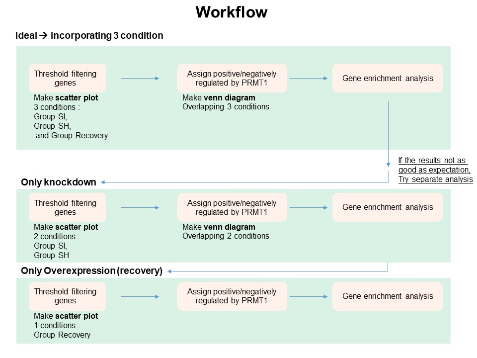

```{r setup, include=FALSE}
knitr::opts_chunk$set(echo = TRUE)
```

# Principle

 Sample types :

* Scramble
* siPRMT1
* shPRMT1
* shPRMT1 + Flag-PRMT1




# Preparation
* Install and load libraries
```{r 1, echo=TRUE, message=FALSE, warning=FALSE}
library(kableExtra)
library(tidyverse)
library(dplyr)
library(ggrepel)
library('ggvenn')
library(DT)
library(forcats)
scale_fill_aziz <- function(...){
  library(scales)
  discrete_scale("fill","aziz",manual_pal(values = c("#386cb0","#fdb462","#7fc97f","#a6cee3","#fb9a99","#984ea3","#ffff33")), ...)
  
}

scale_colour_aziz <- function(...){
  library(scales)
  discrete_scale("colour","aziz",manual_pal(values = c("#386cb0","#fdb462","#7fc97f","#ef3b2c","#662506","#a6cee3","#fb9a99","#984ea3","#ffff33")), ...)
}
theme_Publication <- function(base_size=14, base_family="helvetica") {
  library(grid)
  library(ggthemes)
  (theme_foundation(base_size=base_size, base_family=base_family)
    + theme(plot.title = element_text(face = "bold",
                                      size = rel(1.2), hjust = 0.5),
            text = element_text(),
            panel.background = element_rect(colour = NA),
            plot.background = element_rect(colour = NA),
            panel.border = element_rect(colour = NA),
            axis.title = element_text(face = "bold",size = rel(1)),
            axis.title.y = element_text(angle=90,vjust =2),
            axis.title.x = element_text(vjust = -0.2),
            axis.text = element_text(), 
            axis.line = element_line(colour="black"),
            axis.ticks = element_line(),
            panel.grid.major = element_line(colour="#f0f0f0"),
            panel.grid.minor = element_blank(),
            legend.key = element_rect(colour = NA),
            legend.position = "bottom",
            legend.direction = "horizontal",
            legend.key.size= unit(0.2, "cm"),
            legend.margin = unit(0, "cm"),
            legend.title = element_text(face="italic"),
            plot.margin=unit(c(10,5,5,5),"mm"),
            strip.background=element_rect(colour="#f0f0f0",fill="#f0f0f0"),
            strip.text = element_text(face="bold"),
            plot.subtitle = element_text(hjust = 0.5)
    ))
}

create_dt<-function(x){
  DT::datatable(x,
                extensions = 'Buttons',
                options = list(dom='Blfrtip',
                               buttons=c('copy', 'csv', 'excel','pdf', 'print'),
                               lengthMenu=list(c(10,25,50,-1),
                                               c(10,25,50,'All'))))
}
```
<br>

# Load RNAseq results

```{r 2, echo=TRUE}
fc<-read.delim("~/Repository/repository/docs/PRMT1/FC PRMT.csv") #load dataframe and name it fc
head(fc)
fc<-fc %>% 
  dplyr::select(1,2,3,5,6,7,8,9) #remove unneccessary column (shrecovery/Scramble)
head(fc)
colnames(fc)
{colnames(fc)[1]<-"Gene"
colnames(fc)[2]<-"FC.shPRMT1.per.Scramble"
colnames(fc)[3]<-"FC.siPRMT1.per.Scramble"
colnames(fc)[4]<-"FC.shPRMT1plusPRMT1.per.shPRMT1"
colnames(fc)[5]<-"Scramble"
colnames(fc)[6]<-"shPRMT1"
colnames(fc)[7]<-"siPRMT1"
colnames(fc)[8]<-"shPRMT1plusPRMT1"} #change the column name

```
<br>

# Threshold filtering (DEGs)
* Differentially expressed genes (DEGs) commonly selected after threshold filtering using both log FC value and p-value. 
* But since there is no replication in the sample, we can filter DEGs based on log FC value only.

```{r 3, echo=TRUE}
fc<-fc %>% 
  mutate(grupSH=case_when(FC.shPRMT1.per.Scramble > 2 ~ 'Upregulated',
                        FC.shPRMT1.per.Scramble < 0.5 ~ 'Downregulated',
                        TRUE ~ 'Not-regulated')) %>% 
  mutate(grupSI=case_when(FC.siPRMT1.per.Scramble > 2 ~ 'Upregulated',
                          FC.siPRMT1.per.Scramble < 0.5 ~ 'Downregulated',
                          TRUE ~ 'Not-regulated')) %>% 
  mutate(grupREC=case_when(FC.shPRMT1plusPRMT1.per.shPRMT1 > 2 ~ 'Upregulated',
                           FC.shPRMT1plusPRMT1.per.shPRMT1 < 0.5 ~ 'Downregulated',
                          TRUE ~ 'Not-regulated'))

create_dt(fc)


```
## Scatter plot
```{r scatter1, echo=TRUE, message=FALSE, warning=FALSE}
# SH vs Scramble
fc %>% 
  ggplot(aes(x=Scramble,y=shPRMT1,color=grupSH))+
  geom_point(size=1.5)+
  geom_label_repel(aes(label=ifelse(Gene == 'PRMT1',as.character(Gene),'')),
                  box.padding   = .35, 
                  point.padding = 0.5,
                  max.overlaps = Inf,
                  segment.color = 'grey50',show.legend = F)+ #label PRMT1
  theme_classic()+
  scale_colour_manual(values = c('#a6cee3','gray','#fb9a99'))+
  theme_Publication()+
  theme(aspect.ratio = 1)+
  ylab("sh-PRMT1")+
  xlab("Scramble")+
  ggtitle("Group SH")

fc %>% 
  ggplot(aes(x=Scramble,y=siPRMT1,color=grupSI))+
  geom_point(size=1.5)+
  geom_label_repel(aes(label=ifelse(Gene == 'PRMT1',as.character(Gene),'')),
                  box.padding   = .35, 
                  point.padding = 0.5,
                  max.overlaps = Inf,
                  segment.color = 'grey50',show.legend = F)+ #label PRMT1
  theme_classic()+
  scale_colour_manual(values = c('#a6cee3','gray','#fb9a99'))+
  theme_Publication()+
  theme(aspect.ratio = 1)+
    ylab("si-PRMT1")+
  xlab("Scramble")+
  ggtitle("Group SI")

fc %>% 
  ggplot(aes(x=shPRMT1,y=shPRMT1plusPRMT1,color=grupREC))+
  geom_point(size=1.5)+
  geom_label_repel(aes(label=ifelse(Gene == 'PRMT1',as.character(Gene),'')),
                  box.padding   = .35, 
                  point.padding = 0.5,
                  max.overlaps = Inf,
                  segment.color = 'grey50',show.legend = F)+ #label PRMT1
  theme_classic()+
  scale_colour_manual(values = c('#a6cee3','gray','#fb9a99'))+
  theme_Publication()+
  theme(aspect.ratio = 1)+
  ylab("sh-PRMT1 + Flag-PRMT1")+
  xlab("sh-PRMT1")+
  ggtitle("Group Recovery")


```


<br>

# Assigning genes
<br>
* Make a venn diagram to see overlapping DEGs in 3 conditions.

### Venn diagram

```{r venn, echo=TRUE, message=FALSE, warning=FALSE}

# Filtered regulated genes to make venn
SH.regulated<-fc %>% 
  filter(grupSH == 'Downregulated' | grupSH == 'Upregulated')
SI.regulated<-fc %>% 
  filter(grupSI == 'Downregulated' | grupSI == 'Upregulated')
REC.regulated<-fc %>% 
  filter(grupREC == 'Downregulated' | grupREC == 'Upregulated')

D<-list('Group SH'=as.character(SH.regulated$Gene),
        'Group SI'=as.character(SI.regulated$Gene),
        'Group Recovery'=as.character(REC.regulated$Gene))

ggvenn(D,fill_color = c("#386cb0","#fdb462","gray"),fill_alpha = .3,text_size = 5,show_percentage = F)+
  ggtitle("Overlap of all genes passing the threshold (DEGs)")

```
<br>
* From venn we can see about 119 DEGs overlap, then we filter again and assign positive or negatively regulated by PRMT1
<br>
```{r over, echo=TRUE, message=FALSE, warning=FALSE}
#what are those genes?
overlap<-as.data.frame(intersect(as.character(REC.regulated$Gene),intersect(x=as.character(SH.regulated$Gene),y=as.character(SI.regulated$Gene))))
colnames(overlap)[1]<-"Gene"
overlap

#leftjoin to other parameter
overlap<-overlap %>% 
  left_join(fc) %>% 
  select(Gene,grupSH,grupSI,grupREC)

create_dt(overlap)

```

# Scenario 1 (Ideal)

## Positively regulated by PRMT1
### Make venn only positive
```{r S1pos, echo=TRUE, message=FALSE, warning=FALSE}
# We can make venn again only positive
pos.SH<-SH.regulated %>% 
  filter(grupSH=='Downregulated')
pos.SI<-SI.regulated %>% 
  filter(grupSI=='Downregulated')
pos.REC<-REC.regulated %>% 
  filter(grupREC=='Upregulated')

s1.list.pos<-list('Group SH'=as.character(pos.SH$Gene),
                   'Group SI'=as.character(pos.SI$Gene),
                   'Group Recovery'=as.character(pos.REC$Gene))

v1pos<-ggvenn(s1.list.pos,fill_color = c("#386cb0","#fdb462","gray"),fill_alpha = .3,text_size = 5,show_percentage = F)+
  ggtitle("Overlap DEGs",subtitle = "Positively regulated by PRMT1")

v1pos
```
<br>

### Datatable overlap positive
```{r dat pos, echo=TRUE, message=FALSE, warning=FALSE}
S1.Positive.cor<-(overlap %>% filter(grupSH == 'Downregulated' & grupSI == 'Downregulated' & grupREC == 'Upregulated'))
create_dt(S1.Positive.cor)
```
<br>

### Enrichment analysis
```{r enrich1, echo=TRUE, message=FALSE, warning=FALSE}
library(enrichR)
setEnrichrSite("Enrichr") # Human genes
websiteLive <- TRUE


dbs <- c("KEGG_2021_Human","MSigDB_Hallmark_2020")
if (is.null(dbs)) websiteLive <- FALSE
if (websiteLive) {
    enriched <- enrichr(c(S1.Positive.cor$Gene), dbs)
}


s1.kegg.pos<-as.data.frame(if (websiteLive) enriched[["KEGG_2021_Human"]])
create_dt(s1.kegg.pos)

colnames(s1.kegg.pos)
en.kegg.pos<-s1.kegg.pos %>% 
  filter(P.value < 0.05) %>% 
  mutate(minlog=-(log10(P.value))) %>% 
  arrange(desc(minlog)) %>% 
  slice(1:20) %>% 
  mutate(name=fct_reorder(Term,minlog)) %>% 
  ggplot(aes(x=minlog,y=name,fill=minlog))+
  geom_bar(stat="identity")+
  theme_Publication()+
  scale_x_continuous(expand=expand_scale(mult = c(0,0.2)))+
  theme(axis.title.y = element_blank(),
        legend.position = 'right',
        legend.direction = 'vertical',
        panel.grid.major.x = element_blank(),
        aspect.ratio = 1.8,
        legend.key.size= unit(.5, "cm"),
        axis.text.y = element_text(size=9.5))+
  scale_fill_viridis_c()+
  xlab(expression(- log[10]*"(P-value)"))+
  labs(fill=expression(- log[10]*"(P-value)"))+
  ggtitle("Top 20 KEGG_2021_Human",subtitle = 'Positively regulated by PRMT1')
en.kegg.pos

Msig.pos<-as.data.frame(if (websiteLive) enriched[["MSigDB_Hallmark_2020"]])
create_dt(Msig.pos)

s1.en.Msig.pos<-Msig.pos %>% 
  filter(P.value < 0.05) %>% 
  mutate(minlog=-(log10(P.value))) %>% 
  arrange(desc(minlog)) %>% 
  slice(1:20) %>% 
  mutate(name=fct_reorder(Term,minlog)) %>% 
  ggplot(aes(x=minlog,y=name,fill=minlog))+
  geom_bar(stat="identity")+
  theme_Publication()+
  scale_x_continuous(expand=expand_scale(mult = c(0,0.2)))+
  theme(axis.title.y = element_blank(),
        legend.position = 'right',
        legend.direction = 'vertical',
        panel.grid.major.x = element_blank(),
        aspect.ratio = 1,
        legend.key.size= unit(.5, "cm"))+
  scale_fill_viridis_c()+
  xlab(expression(- log[10]*"(P-value)"))+
  labs(fill=expression(- log[10]*"(P-value)"))+
  ggtitle("MSigDB_Hallmark_2020",subtitle = 'Positively regulated by PRMT1')
s1.en.Msig.pos

```
<br>

## Negatively regulated by PRMT1
### Make venn only negative
```{r S1neg, echo=TRUE, message=FALSE, warning=FALSE}
# We can make venn again only negative
neg.SH<-SH.regulated %>% 
  filter(grupSH=='Upregulated')
neg.SI<-SI.regulated %>% 
  filter(grupSI=='Upregulated')
neg.REC<-REC.regulated %>% 
  filter(grupREC=='Downregulated')

s1.list.neg<-list('Group SH'=as.character(neg.SH$Gene),
                   'Group SI'=as.character(neg.SI$Gene),
                   'Group Recovery'=as.character(neg.REC$Gene))

v1neg<-ggvenn(s1.list.neg,fill_color = c("#386cb0","#fdb462","gray"),fill_alpha = .3,text_size = 5,show_percentage = F)+
  ggtitle("Overlap DEGs",subtitle = "Negatively regulated by PRMT1")
v1neg
```
<br>

### Datatable overlap negative
```{r dat neg, echo=TRUE, message=FALSE, warning=FALSE}
S1.Negative.cor<-(overlap %>% filter(grupSH == 'Upregulated' & grupSI == 'Upregulated' & grupREC == 'Downregulated'))
create_dt(S1.Negative.cor)
```
<br>

### Enrichment analysis
```{r enrich2, echo=TRUE, message=FALSE, warning=FALSE}
library(enrichR)
setEnrichrSite("Enrichr") # Human genes
websiteLive <- TRUE


dbs <- c("KEGG_2021_Human","MSigDB_Hallmark_2020")
if (is.null(dbs)) websiteLive <- FALSE
if (websiteLive) {
    enriched <- enrichr(c(S1.Negative.cor$Gene), dbs)
}


kegg.neg<-as.data.frame(if (websiteLive) enriched[["KEGG_2021_Human"]])
create_dt(kegg.neg)

en.kegg.neg<-kegg.neg %>% 
  filter(P.value < 0.05) %>% 
  mutate(minlog=-(log10(P.value))) %>% 
  arrange(desc(minlog)) %>% 
  slice(1:20) %>% 
  mutate(name=fct_reorder(Term,minlog)) %>% 
  ggplot(aes(x=minlog,y=name,fill=minlog))+
  geom_bar(stat="identity")+
  theme_Publication()+
  scale_x_continuous(expand=expand_scale(mult = c(0,0.2)))+
  theme(axis.title.y = element_blank(),
        legend.position = 'right',
        legend.direction = 'vertical',
        panel.grid.major.x = element_blank(),
        aspect.ratio = 1.65,
        legend.key.size= unit(.5, "cm"))+
  scale_fill_viridis_c()+
  xlab(expression(- log[10]*"(P-value)"))+
  labs(fill=expression(- log[10]*"(P-value)"))+
  ggtitle("KEGG_2021_Human",subtitle = 'Negatively regulated by PRMT1')
en.kegg.neg

Msig.neg<-as.data.frame(if (websiteLive) enriched[["MSigDB_Hallmark_2020"]])
create_dt(Msig.neg)

en.Msig.neg<-Msig.neg %>% 
  filter(P.value < 0.05) %>% 
  mutate(minlog=-(log10(P.value))) %>% 
  arrange(desc(minlog)) %>% 
  slice(1:20) %>% 
  mutate(name=fct_reorder(Term,minlog)) %>% 
  ggplot(aes(x=minlog,y=name,fill=minlog))+
  geom_bar(stat="identity")+
  theme_Publication()+
  scale_x_continuous(expand=expand_scale(mult = c(0,0.2)))+
  theme(axis.title.y = element_blank(),
        legend.position = 'right',
        legend.direction = 'vertical',
        panel.grid.major.x = element_blank(),
        aspect.ratio = .5,
        legend.key.size= unit(.5, "cm"))+
  scale_fill_viridis_c()+
  xlab(expression(- log[10]*"(P-value)"))+
  labs(fill=expression(- log[10]*"(P-value)"))+
  ggtitle("MSigDB_Hallmark_2020",subtitle = 'Negatively regulated by PRMT1')
en.Msig.neg

```

<br>

# Scenario 2

* Scenario 2 consider knockdown and overexpression by analyzing separately

## Knockdown

### Compare using venn diagram

```{r collectS1pos, echo=TRUE, message=FALSE, warning=FALSE}
library(gridExtra)
grid.arrange(v1pos,v1neg,ncol=2) 

s2.list.pos<-list('Group SH'=as.character(pos.SH$Gene),
                   'Group SI'=as.character(pos.SI$Gene))

v2pos<-ggvenn(s2.list.pos,fill_color = c("#386cb0","#fdb462"),fill_alpha = .3,text_size = 5,show_percentage = F)+
  ggtitle("Overlap DEGs",subtitle = "Positively regulated by PRMT1")

s2.list.neg<-list('Group SH'=as.character(neg.SH$Gene),
                   'Group SI'=as.character(neg.SI$Gene))

v2neg<-ggvenn(s2.list.neg,fill_color = c("#386cb0","#fdb462"),fill_alpha = .3,text_size = 5,show_percentage = F)+
  ggtitle("Overlap DEGs",subtitle = "Negatively regulated by PRMT1")

# Venn only knockdown
grid.arrange(v2pos,v2neg,ncol=2)

```

<br>

### Datatable overlap 
```{r dat s2, echo=TRUE, message=FALSE, warning=FALSE}
overlap<-as.data.frame(intersect(x=as.character(SH.regulated$Gene),y=as.character(SI.regulated$Gene)))
colnames(overlap)[1]<-"Gene"

overlap<-overlap %>% 
  left_join(fc) %>% 
  select(Gene,grupSH,grupSI)

S2.Positive.cor<-(overlap %>% filter(grupSH == 'Downregulated' & grupSI == 'Downregulated'))
create_dt(S2.Positive.cor)

S2.Negative.cor<-(overlap %>% filter(grupSH == 'Upregulated' & grupSI == 'Upregulated'))
create_dt(S2.Negative.cor)
```

<br>


### Enrichment analysis (Positive)
```{r enrich4, echo=TRUE, message=FALSE, warning=FALSE}
library(enrichR)
setEnrichrSite("Enrichr") # Human genes
websiteLive <- TRUE


dbs <- c("KEGG_2021_Human","MSigDB_Hallmark_2020")
if (is.null(dbs)) websiteLive <- FALSE
if (websiteLive) {
    enriched <- enrichr(c(S2.Positive.cor$Gene), dbs)
}


kegg.pos<-as.data.frame(if (websiteLive) enriched[["KEGG_2021_Human"]])
create_dt(kegg.pos)

en.kegg.pos<-kegg.pos %>% 
  filter(P.value < 0.05) %>% 
  mutate(minlog=-(log10(P.value))) %>% 
  arrange(desc(minlog)) %>% 
  slice(1:20) %>% 
  mutate(name=fct_reorder(Term,minlog)) %>% 
  ggplot(aes(x=minlog,y=name,fill=minlog))+
  geom_bar(stat="identity")+
  theme_Publication()+
  scale_x_continuous(expand=expand_scale(mult = c(0,0.2)))+
  theme(axis.title.y = element_blank(),
        legend.position = 'right',
        legend.direction = 'vertical',
        panel.grid.major.x = element_blank(),
        aspect.ratio = 1.65,
        legend.key.size= unit(.5, "cm"),
        axis.text.y = element_text(size=10))+
  scale_fill_viridis_c()+
  xlab(expression(- log[10]*"(P-value)"))+
  labs(fill=expression(- log[10]*"(P-value)"))+
  ggtitle("KEGG_2021_Human",subtitle = 'Positively regulated by PRMT1')
en.kegg.pos

Msig.pos<-as.data.frame(if (websiteLive) enriched[["MSigDB_Hallmark_2020"]])
create_dt(Msig.pos)

en.Msig.pos<-Msig.pos %>% 
  filter(P.value < 0.05) %>% 
  mutate(minlog=-(log10(P.value))) %>% 
  arrange(desc(minlog)) %>% 
  slice(1:20) %>% 
  mutate(name=fct_reorder(Term,minlog)) %>% 
  ggplot(aes(x=minlog,y=name,fill=minlog))+
  geom_bar(stat="identity")+
  theme_Publication()+
  scale_x_continuous(expand=expand_scale(mult = c(0,0.2)))+
  theme(axis.title.y = element_blank(),
        legend.position = 'right',
        legend.direction = 'vertical',
        panel.grid.major.x = element_blank(),
        aspect.ratio = 1.7,
        legend.key.size= unit(.5, "cm"))+
  scale_fill_viridis_c()+
  xlab(expression(- log[10]*"(P-value)"))+
  labs(fill=expression(- log[10]*"(P-value)"))+
  ggtitle("MSigDB_Hallmark_2020",subtitle = 'Positively regulated by PRMT1')
en.Msig.pos

```

<br>

### Enrichment analysis (negative)
```{r enrich3, echo=TRUE, message=FALSE, warning=FALSE}
library(enrichR)
setEnrichrSite("Enrichr") # Human genes
websiteLive <- TRUE


dbs <- c("KEGG_2021_Human","MSigDB_Hallmark_2020")
if (is.null(dbs)) websiteLive <- FALSE
if (websiteLive) {
    enriched <- enrichr(c(S2.Negative.cor$Gene), dbs)
}


kegg.neg<-as.data.frame(if (websiteLive) enriched[["KEGG_2021_Human"]])
create_dt(kegg.neg)

en.kegg.neg<-kegg.neg %>% 
  filter(P.value < 0.05) %>% 
  mutate(minlog=-(log10(P.value))) %>% 
  arrange(desc(minlog)) %>% 
  slice(1:20) %>% 
  mutate(name=fct_reorder(Term,minlog)) %>% 
  ggplot(aes(x=minlog,y=name,fill=minlog))+
  geom_bar(stat="identity")+
  theme_Publication()+
  scale_x_continuous(expand=expand_scale(mult = c(0,0.2)))+
  theme(axis.title.y = element_blank(),
        legend.position = 'right',
        legend.direction = 'vertical',
        panel.grid.major.x = element_blank(),
        aspect.ratio = 1.65,
        legend.key.size= unit(.5, "cm"))+
  scale_fill_viridis_c()+
  xlab(expression(- log[10]*"(P-value)"))+
  labs(fill=expression(- log[10]*"(P-value)"))+
  ggtitle("KEGG_2021_Human",subtitle = 'Negatively regulated by PRMT1')
en.kegg.neg

Msig.neg<-as.data.frame(if (websiteLive) enriched[["MSigDB_Hallmark_2020"]])
create_dt(Msig.neg)

en.Msig.neg<-Msig.neg %>% 
  filter(P.value < 0.05) %>% 
  mutate(minlog=-(log10(P.value))) %>% 
  arrange(desc(minlog)) %>% 
  slice(1:20) %>% 
  mutate(name=fct_reorder(Term,minlog)) %>% 
  ggplot(aes(x=minlog,y=name,fill=minlog))+
  geom_bar(stat="identity")+
  theme_Publication()+
  scale_x_continuous(expand=expand_scale(mult = c(0,0.2)))+
  theme(axis.title.y = element_blank(),
        legend.position = 'right',
        legend.direction = 'vertical',
        panel.grid.major.x = element_blank(),
        aspect.ratio = .5,
        legend.key.size= unit(.5, "cm"))+
  scale_fill_viridis_c()+
  xlab(expression(- log[10]*"(P-value)"))+
  labs(fill=expression(- log[10]*"(P-value)"))+
  ggtitle("MSigDB_Hallmark_2020",subtitle = 'Negatively regulated by PRMT1')
en.Msig.neg

```

<br>

## Recovery

* Since there is no replicate in recovery, instead of making venn diagram, we can directly assign positive and negative DEGs

### Datatable 
```{r datatbles2}
s2.REC.pos<-REC.regulated %>% 
  filter(grupREC=='Upregulated') %>% 
  select(Gene,grupREC)
create_dt(s2.REC.pos)

s2.REC.neg<-REC.regulated %>% 
  filter(grupREC=='Downregulated') %>% 
  select(Gene,grupREC)
create_dt(s2.REC.neg)
```

<br>

### Enrichment (Positive)

```{r recoverys2Pos, echo=TRUE, message=FALSE, warning=FALSE}
setEnrichrSite("Enrichr") # Human genes
websiteLive <- TRUE
dbs <- c("KEGG_2021_Human","MSigDB_Hallmark_2020")
if (is.null(dbs)) websiteLive <- FALSE
if (websiteLive) {
    enriched <- enrichr(c(s2.REC.pos$Gene), dbs)
}


kegg.pos<-as.data.frame(if (websiteLive) enriched[["KEGG_2021_Human"]])
create_dt(kegg.pos)

en.kegg.pos<-kegg.pos %>% 
  filter(P.value < 0.05) %>% 
  mutate(minlog=-(log10(P.value))) %>% 
  arrange(desc(minlog)) %>% 
  slice(1:20) %>% 
  mutate(name=fct_reorder(Term,minlog)) %>% 
  ggplot(aes(x=minlog,y=name,fill=minlog))+
  geom_bar(stat="identity")+
  theme_Publication()+
  scale_x_continuous(expand=expand_scale(mult = c(0,0.2)))+
  theme(axis.title.y = element_blank(),
        legend.position = 'right',
        legend.direction = 'vertical',
        panel.grid.major.x = element_blank(),
        aspect.ratio = 1.9,
        legend.key.size= unit(.5, "cm"),
        axis.text.y=element_text(size = 10))+
  scale_fill_viridis_c()+
  xlab(expression(- log[10]*"(P-value)"))+
  labs(fill=expression(- log[10]*"(P-value)"))+
  ggtitle("KEGG_2021_Human",subtitle = 'Positively regulated by PRMT1')
en.kegg.pos

Msig.pos<-as.data.frame(if (websiteLive) enriched[["MSigDB_Hallmark_2020"]])
create_dt(Msig.pos)

en.Msig.pos<-Msig.pos %>% 
  filter(P.value < 0.05) %>% 
  mutate(minlog=-(log10(P.value))) %>% 
  arrange(desc(minlog)) %>% 
  slice(1:20) %>% 
  mutate(name=fct_reorder(Term,minlog)) %>% 
  ggplot(aes(x=minlog,y=name,fill=minlog))+
  geom_bar(stat="identity")+
  theme_Publication()+
  scale_x_continuous(expand=expand_scale(mult = c(0,0.2)))+
  theme(axis.title.y = element_blank(),
        legend.position = 'right',
        legend.direction = 'vertical',
        panel.grid.major.x = element_blank(),
        aspect.ratio = 1.65,
        legend.key.size= unit(.5, "cm"))+
  scale_fill_viridis_c()+
  xlab(expression(- log[10]*"(P-value)"))+
  labs(fill=expression(- log[10]*"(P-value)"))+
  ggtitle("MSigDB_Hallmark_2020",subtitle = 'Positively regulated by PRMT1')
en.Msig.pos

```
<br>

### Enrichment (Negative)

```{r recoverys2Neg, echo=TRUE, message=FALSE, warning=FALSE}
setEnrichrSite("Enrichr") # Human genes
websiteLive <- TRUE
dbs <- c("KEGG_2021_Human","MSigDB_Hallmark_2020")
if (is.null(dbs)) websiteLive <- FALSE
if (websiteLive) {
    enriched <- enrichr(c(s2.REC.neg$Gene), dbs)
}


kegg.neg<-as.data.frame(if (websiteLive) enriched[["KEGG_2021_Human"]])
create_dt(kegg.neg)

en.kegg.neg<-kegg.neg %>% 
  filter(P.value < 0.05) %>% 
  mutate(minlog=-(log10(P.value))) %>% 
  arrange(desc(minlog)) %>% 
  slice(1:20) %>% 
  mutate(name=fct_reorder(Term,minlog)) %>% 
  ggplot(aes(x=minlog,y=name,fill=minlog))+
  geom_bar(stat="identity")+
  theme_Publication()+
  scale_x_continuous(expand=expand_scale(mult = c(0,0.2)))+
  theme(axis.title.y = element_blank(),
        legend.position = 'right',
        legend.direction = 'vertical',
        panel.grid.major.x = element_blank(),
        aspect.ratio = 1.65,
        legend.key.size= unit(.5, "cm"))+
  scale_fill_viridis_c()+
  xlab(expression(- log[10]*"(P-value)"))+
  labs(fill=expression(- log[10]*"(P-value)"))+
  ggtitle("KEGG_2021_Human",subtitle = 'Negatively regulated by PRMT1')
en.kegg.neg

Msig.neg<-as.data.frame(if (websiteLive) enriched[["MSigDB_Hallmark_2020"]])
create_dt(Msig.neg)

en.Msig.neg<-Msig.neg %>% 
  filter(P.value < 0.05) %>% 
  mutate(minlog=-(log10(P.value))) %>% 
  arrange(desc(minlog)) %>% 
  slice(1:20) %>% 
  mutate(name=fct_reorder(Term,minlog)) %>% 
  ggplot(aes(x=minlog,y=name,fill=minlog))+
  geom_bar(stat="identity")+
  theme_Publication()+
  scale_x_continuous(expand=expand_scale(mult = c(0,0.2)))+
  theme(axis.title.y = element_blank(),
        legend.position = 'right',
        legend.direction = 'vertical',
        panel.grid.major.x = element_blank(),
        aspect.ratio = 0.7,
        legend.key.size= unit(.5, "cm"))+
  scale_fill_viridis_c()+
  xlab(expression(- log[10]*"(P-value)"))+
  labs(fill=expression(- log[10]*"(P-value)"))+
  ggtitle("MSigDB_Hallmark_2020",subtitle = 'Negatively regulated by PRMT1')
en.Msig.neg

```
<br>

# Scenario 3 

In this scenario, we simply excluded si PRMT group.

## Make venn

```{r , echo=TRUE, message=FALSE, warning=FALSE}

pos.SH<-SH.regulated %>% 
  filter(grupSH=='Downregulated')
pos.REC<-REC.regulated %>% 
  filter(grupREC=='Upregulated')
neg.SH<-SH.regulated %>% 
  filter(grupSH=='Upregulated')
neg.REC<-REC.regulated %>% 
  filter(grupREC=='Downregulated')

s3.list.pos<-list('Group SH'=as.character(pos.SH$Gene),
                   'Group Recovery'=as.character(pos.REC$Gene))
s3.list.neg<-list('Group SH'=as.character(neg.SH$Gene),
                   'Group Recovery'=as.character(neg.REC$Gene))


v3pos<-ggvenn(s3.list.pos,fill_color = c("#386cb0","#fdb462"),fill_alpha = .3,text_size = 5,show_percentage = F,set_name_size = 5)+
  ggtitle("Overlap DEGs",subtitle = "Positively regulated by PRMT1")
v3neg<-ggvenn(s3.list.neg,fill_color = c("#386cb0","#fdb462"),fill_alpha = .3,text_size = 5,show_percentage = F,set_name_size = 5)+
  ggtitle("Overlap DEGs",subtitle = "Negatively regulated by PRMT1")


grid.arrange(v3pos,v3neg,ncol=2)

```

<br>

### Datatable
```{r , echo=TRUE, message=FALSE, warning=FALSE}
overlap<-as.data.frame(intersect(x=as.character(SH.regulated$Gene),y=as.character(REC.regulated$Gene)))
colnames(overlap)[1]<-"Gene"

overlap<-overlap %>% 
  left_join(fc) %>% 
  select(Gene,grupSH,grupREC)

# Positive
S3.Positive.cor<-(overlap %>% filter(grupSH == 'Downregulated' & grupREC == 'Upregulated'))
create_dt(S3.Positive.cor)

#negative
S3.Negative.cor<-(overlap %>% filter(grupSH == 'Upregulated' & grupREC == 'Downregulated'))
create_dt(S3.Negative.cor)

```


<br>

### Enrichment (Positive)
```{r , echo=TRUE, message=FALSE, warning=FALSE}
library(enrichR)
setEnrichrSite("Enrichr") # Human genes
websiteLive <- TRUE


dbs <- c("KEGG_2021_Human","MSigDB_Hallmark_2020")
if (is.null(dbs)) websiteLive <- FALSE
if (websiteLive) {
    enriched <- enrichr(c(S3.Positive.cor$Gene), dbs)
}


s3.kegg.pos<-as.data.frame(if (websiteLive) enriched[["KEGG_2021_Human"]])
create_dt(s1.kegg.pos)

colnames(s3.kegg.pos)
en.kegg.pos<-s3.kegg.pos %>% 
  filter(P.value < 0.05) %>% 
  mutate(minlog=-(log10(P.value))) %>% 
  arrange(desc(minlog)) %>% 
  slice(1:20) %>% 
  mutate(name=fct_reorder(Term,minlog)) %>% 
  ggplot(aes(x=minlog,y=name,fill=minlog))+
  geom_bar(stat="identity")+
  theme_Publication()+
  scale_x_continuous(expand=expand_scale(mult = c(0,0.2)))+
  theme(axis.title.y = element_blank(),
        legend.position = 'right',
        legend.direction = 'vertical',
        panel.grid.major.x = element_blank(),
        aspect.ratio = 1.8,
        legend.key.size= unit(.5, "cm"),
        axis.text.y = element_text(size=9))+
  scale_fill_viridis_c()+
  xlab(expression(- log[10]*"(P-value)"))+
  labs(fill=expression(- log[10]*"(P-value)"))+
  ggtitle("Top 20 KEGG_2021_Human",subtitle = 'Positively regulated by PRMT1')
en.kegg.pos

Msig.pos<-as.data.frame(if (websiteLive) enriched[["MSigDB_Hallmark_2020"]])
create_dt(Msig.pos)

s3.en.Msig.pos<-Msig.pos %>% 
  filter(P.value < 0.05) %>% 
  mutate(minlog=-(log10(P.value))) %>% 
  arrange(desc(minlog)) %>% 
  slice(1:20) %>% 
  mutate(name=fct_reorder(Term,minlog)) %>% 
  ggplot(aes(x=minlog,y=name,fill=minlog))+
  geom_bar(stat="identity")+
  theme_Publication()+
  scale_x_continuous(expand=expand_scale(mult = c(0,0.2)))+
  theme(axis.title.y = element_blank(),
        legend.position = 'right',
        legend.direction = 'vertical',
        panel.grid.major.x = element_blank(),
        aspect.ratio = 1,
        legend.key.size= unit(.5, "cm"))+
  scale_fill_viridis_c()+
  xlab(expression(- log[10]*"(P-value)"))+
  labs(fill=expression(- log[10]*"(P-value)"))+
  ggtitle("MSigDB_Hallmark_2020",subtitle = 'Positively regulated by PRMT1')
s3.en.Msig.pos

```
<br>

### Enrichment (Negative)
```{r , echo=TRUE, message=FALSE, warning=FALSE}
library(enrichR)
setEnrichrSite("Enrichr") # Human genes
websiteLive <- TRUE


dbs <- c("KEGG_2021_Human","MSigDB_Hallmark_2020")
if (is.null(dbs)) websiteLive <- FALSE
if (websiteLive) {
    enriched <- enrichr(c(S3.Negative.cor$Gene), dbs)
}


kegg.neg<-as.data.frame(if (websiteLive) enriched[["KEGG_2021_Human"]])
create_dt(kegg.neg)

en.kegg.neg<-kegg.neg %>% 
  filter(P.value < 0.05) %>% 
  mutate(minlog=-(log10(P.value))) %>% 
  arrange(desc(minlog)) %>% 
  slice(1:20) %>% 
  mutate(name=fct_reorder(Term,minlog)) %>% 
  ggplot(aes(x=minlog,y=name,fill=minlog))+
  geom_bar(stat="identity")+
  theme_Publication()+
  scale_x_continuous(expand=expand_scale(mult = c(0,0.2)))+
  theme(axis.title.y = element_blank(),
        legend.position = 'right',
        legend.direction = 'vertical',
        panel.grid.major.x = element_blank(),
        aspect.ratio = 1.5,
        legend.key.size= unit(.5, "cm"))+
  scale_fill_viridis_c()+
  xlab(expression(- log[10]*"(P-value)"))+
  labs(fill=expression(- log[10]*"(P-value)"))+
  ggtitle("KEGG_2021_Human",subtitle = 'Negatively regulated by PRMT1')
en.kegg.neg

Msig.neg<-as.data.frame(if (websiteLive) enriched[["MSigDB_Hallmark_2020"]])
create_dt(Msig.neg)

en.Msig.neg<-Msig.neg %>% 
  filter(P.value < 0.05) %>% 
  mutate(minlog=-(log10(P.value))) %>% 
  arrange(desc(minlog)) %>% 
  slice(1:20) %>% 
  mutate(name=fct_reorder(Term,minlog)) %>% 
  ggplot(aes(x=minlog,y=name,fill=minlog))+
  geom_bar(stat="identity")+
  theme_Publication()+
  scale_x_continuous(expand=expand_scale(mult = c(0,0.2)))+
  theme(axis.title.y = element_blank(),
        legend.position = 'right',
        legend.direction = 'vertical',
        panel.grid.major.x = element_blank(),
        aspect.ratio = .25,
        legend.key.size= unit(.5, "cm"))+
  scale_fill_viridis_c()+
  xlab(expression(- log[10]*"(P-value)"))+
  labs(fill=expression(- log[10]*"(P-value)"))+
  ggtitle("MSigDB_Hallmark_2020",subtitle = 'Negatively regulated by PRMT1')
en.Msig.neg

```


# Conclusion

* From the results above, it seems that although overlapping genes in 3 conditions (Scenario 1) identified less in venn diagram compared to Scenario 2, the enrichment analysis showed better results (reference to other enrichment analysis from other PRMT1 RNAseq published paper)
* We can now collect and tweak the figuring for publication
* For example for enrichment, we chose only KEGG and selected certain terms

## KEGG term selected
```{r conclusion, echo=TRUE, message=FALSE, warning=FALSE}
create_dt(s1.kegg.pos)

en.kegg.pos<-s1.kegg.pos %>% 
  filter(P.value < 0.05) %>% 
  mutate(minlog=-(log10(P.value))) %>% 
  arrange(desc(minlog)) %>% 
  slice(1:20) %>% 
  filter(Term == "Proteoglycans in cancer" |
           Term == "Salmonella infection"|
           Term == "MAPK signaling pathway"|
           Term == "Signaling pathways regulating pluripotency of stem cells"|
           Term == "Breast cancer"|
           Term == "Gastric cancer") %>% 
  mutate(name=fct_reorder(Term,minlog)) %>% 
  ggplot(aes(x=minlog,y=name,fill=minlog))+
  geom_bar(stat="identity")+
  theme_Publication()+
  scale_x_continuous(expand=expand_scale(mult = c(0,0.2)))+
  theme(axis.title.y = element_blank(),
        legend.position = 'right',
        legend.direction = 'vertical',
        panel.grid.major.x = element_blank(),
        aspect.ratio = 1.5,
        legend.key.size= unit(.5, "cm"))+
  scale_fill_viridis_c()+
  xlab(expression(- log[10]*"(P-value)"))+
  labs(fill=expression(- log[10]*"(P-value)"))+
  ggtitle("KEGG_2021_Human",subtitle = 'Positively regulated by PRMT1')

en.kegg.pos

```

<br>

## Connecting with clinical specimen

* Remember, KEGG above is only enrichment from 28 genes as show in venn and datatable below. In total 28+14= 42 genes are regulated by PRMT1, now how about the expression of these genes in gastric cancer tissues?

```{r conclusion2, echo=TRUE, message=FALSE, warning=FALSE}
grid.arrange(v1pos,v1neg,ncol=2)

# Positive
create_dt(S1.Positive.cor)

# Negative
create_dt(S1.Negative.cor)


# In Gene Expression Note 2 we have downloaded rse of STAD TCGA using TCGAbiolinks
## Just need data preparation, normalization, filtering, and retrieve 42 genes from this dataset
library(TCGAbiolinks)

rse <- get(load("STADIllumina_HiSeq.rda"))

dataPrep_STAD<-TCGAanalyze_Preprocessing(rse,
                                         cor.cut = .5,
                                         datatype = "raw_count",
                                         filename = "STAD_IlluminaHiSeq_RNASeqV2.png")

# Normalization and filtering
dataNorm<-TCGAanalyze_Normalization(tabDF = dataPrep_STAD,geneInfo = geneInfo,method = "gcContent")

dim(dataNorm)

# quantile filter of genes
dataFilt <- TCGAanalyze_Filtering(tabDF = dataNorm,
                                  method = "quantile",
                                  qnt.cut =  0.25)
dim(dataFilt)

```

### Gene filtering

```{r echo=TRUE, message=FALSE, warning=FALSE}
f.dataFilt<-dataFilt
dim(f.dataFilt)

f.dataFilt<-as.data.frame(f.dataFilt) %>% 
  mutate(Gene=row.names(f.dataFilt)) %>% 
  select(416,1:415)
rownames(f.dataFilt)<-NULL

# get both pos and neg genes
genelist<-rbind(S1.Positive.cor,S1.Negative.cor) %>% 
  select(Gene)

# vlookup leftjoin to other parameter
genelist<-genelist %>% 
  left_join(f.dataFilt)

# check how many genes does not have expression
# probably different gene names/id
# or excluded before because of filtering threshold
sum(is.na(genelist$`TCGA-3M-AB46-01A-11R-A414-31`)) #total 9 genes were not identified, let's ignore this for now

# exclude those gene
genelist<-genelist %>% 
      drop_na()

create_dt(genelist)


```


<br>

### Heatmap

* Now, Let's try make a heatmap of all patients and do both row and column clustering.

```{r echo=TRUE, message=FALSE, warning=FALSE, fig.width=10}
h.genelist<-genelist
h.genelist<-t(h.genelist)
colnames(h.genelist)<-h.genelist[1,]
h.genelist<-h.genelist[-1,]

# remove 0 
h.genelist[h.genelist==0] <- NA
h.genelist<-h.genelist[complete.cases(h.genelist),]


m.genelist<-matrix(as.numeric(h.genelist),
                   ncol=ncol(h.genelist))
colnames(m.genelist)<-colnames(h.genelist)
rownames(m.genelist)<-rownames(m.genelist)

m.genelist[m.genelist==0] <- NA
m.genelist<-m.genelist[complete.cases(m.genelist),]

m.genelist<-log(m.genelist)

library(pheatmap)
library(viridis)

cal_z_score <- function(x){
  (x - mean(x)) / sd(x)
}

data_subset_norm <- apply(m.genelist, 2, cal_z_score)
data_subset_norm[data_subset_norm < -2] = -2
data_subset_norm[data_subset_norm > 2] = 2

pheatmap::pheatmap(t(data_subset_norm),
         border_color = 'white')


df.genelist<-as.data.frame(m.genelist)

```
```{r echo=TRUE, message=FALSE, warning=FALSE}

#save the heatmap
png('heatmap prmt shrec stad.png',
    width=1800,height=600,res=150)
dev.off()
```


<br>

### Correlation

* The heatmap does not look good. Probably there are some genes which are not correlated between the DEGs found in our RNAseq and patient tissues.
* Hence, let's try to make correlation matrix first

#### Corelation matrix

```{r echo=TRUE, message=FALSE, warning=FALSE, fig.width=12,fig.height=12}
library(ggstatsplot)
ggstatsplot::ggcorrmat(
  data = df.genelist,
  type = "parametric", # parametric for Pearson, nonparametric for Spearman's correlation
  colors = c("steelblue","white","darkred"), # change default colors
  title = "Correlation matrix of DEGs",
  subtitle = "Stomach Adenocarcinoma (STAD-TCGA)",
  matrix.type ='upper',
  ggcorrplot.args = list(outline.color = "white", 
                         hc.order = TRUE, #clustering
                         pch.cex=3, # x size
                         lab_size=3.25) #label size
  
)+ggplot2::theme(aspect.ratio = 1,
                 axis.text = element_text(size=10, colour = 'black',family = 'Arial'),
                 axis.text.x= element_text(family = 'Arial',hjust =0,vjust = 1)
                 )+scale_x_discrete(position = 'top')
```
<br>

#### Correlation plot

* From the plot above, we can see that PRMT1 significantly (positively) correlate with  TTC5,TFB2M, MYC, C16orf91,and PTS while (negatively) correlate with ZDHHC1, AKT3, EVI5L, TP53INP2, and PTPRB.
* Now we can make the correlation plot of individual patients and statistical analysis

```{r echo=TRUE, message=FALSE, warning=FALSE,fig.width=10}

# wide to long for positive
df.genelist %>% 
  gather('Gene','Value',c(TTC5,TFB2M,MYC, C16orf91,PTS)) %>% 
  select(Gene,Value,PRMT1) %>% 
    ggplot(aes(x=Value,y=PRMT1))+
    geom_smooth(method=lm, fullrange=FALSE,se=TRUE)+
    geom_point()+
  facet_grid(~Gene,scales = "free_x")+
    theme_Publication()+
  theme(aspect.ratio = 1,
        axis.title.x = element_blank())

# wide to long for negative
df.genelist %>% 
  gather('Gene','Value',c(ZDHHC1, AKT3, EVI5L, TP53INP2, PTPRB)) %>% 
  select(Gene,Value,PRMT1) %>% 
    ggplot(aes(x=Value,y=PRMT1))+
    geom_smooth(method=lm, fullrange=FALSE,se=TRUE)+
    geom_point()+
  facet_grid(~Gene,scales = "free_x")+
  theme_Publication()+
  theme(aspect.ratio = 1,
        axis.title.x = element_blank())
```

<br>

#### Datatable correlation
```{r echo=TRUE, message=FALSE, warning=FALSE}
# You can check R and P value one by one like this
cor.test(df.genelist$PRMT1,df.genelist$MYC)

# or using this
library(correlation)

cor.df.genelist<-df.genelist %>% 
  select(PRMT1,TTC5,TFB2M,MYC, C16orf91,PTS,ZDHHC1, AKT3, EVI5L, TP53INP2, PTPRB)

correlation::correlation(cor.df.genelist,
  include_factors = TRUE, method = "auto"
) %>% 
  filter(Parameter1 == 'PRMT1')

```

<br>

#### Selected Heatmap and Cor. Matrix

```{r echo=TRUE, message=FALSE, warning=FALSE,fig.width=10}
sel.df.genelist<-df.genelist %>% 
  select(PRMT1,TTC5,TFB2M,MYC,C16orf91,PTS,ZDHHC1,EVI5L,PTPRB)

ggstatsplot::ggcorrmat(
  data = sel.df.genelist,
  type = "parametric", # parametric for Pearson, nonparametric for Spearman's correlation
  colors = c("steelblue","white","darkred"), # change default colors
  title = "Correlation matrix of DEGs",
  subtitle = "Stomach Adenocarcinoma (STAD-TCGA)",
  matrix.type ='upper',
  ggcorrplot.args = list(outline.color = "white", 
                         hc.order = TRUE, #clustering
                         pch.cex=4, # x size
                         lab_size=3.25) #label size
  
)+ggplot2::theme(aspect.ratio = 1,
                 axis.text = element_text(size=10, colour = 'black',family = 'Arial'),
                 axis.text.x= element_text(family = 'Arial',hjust =0,vjust = 1)
)+scale_x_discrete(position = 'top')

##########

h.genelist<-genelist
h.genelist<-h.genelist %>% 
  filter(Gene == 'PRMT1' |
           Gene == 'TTC5'|
           Gene == 'TFB2M'|
           Gene == 'MYC'|
           Gene == 'C16orf91'|
           Gene == 'PTS'|
           Gene == 'ZDHHC1'|
           Gene == 'EVI5L' |
           Gene == 'PTPRB')

h.genelist<-t(h.genelist)
colnames(h.genelist)<-h.genelist[1,]
h.genelist<-h.genelist[-1,]

# remove 0 
h.genelist[h.genelist==0] <- NA
h.genelist<-h.genelist[complete.cases(h.genelist),]


m.genelist<-matrix(as.numeric(h.genelist),
                   ncol=ncol(h.genelist))
colnames(m.genelist)<-colnames(h.genelist)
rownames(m.genelist)<-rownames(m.genelist)

m.genelist[m.genelist==0] <- NA
m.genelist<-m.genelist[complete.cases(m.genelist),]

m.genelist<-log(m.genelist)

library(pheatmap)
library(viridis)
library(ComplexHeatmap)

cal_z_score <- function(x){
  (x - mean(x)) / sd(x)
}

data_subset_norm <- apply(m.genelist, 2, cal_z_score)
data_subset_norm[data_subset_norm < -2] = -2
data_subset_norm[data_subset_norm > 2] = 2

colmy<-colorRampPalette(c("#4DBBD5B2","white","#E64B35B2"))(50)
colmy<-paste0(colmy,'7f')

```

```{r echo=TRUE, message=FALSE, warning=FALSE,fig.width=12,fig.height=4}

ComplexHeatmap::pheatmap(t(data_subset_norm),
                         show_colnames = F,
                         color = colmy,
                         #row_title = "Genes", row_title_rot = 0,
                         column_title = "Patients",
                         heatmap_legend_param = list(title = gt_render("<span style='color:black'>*z-score*</span>")))
```


