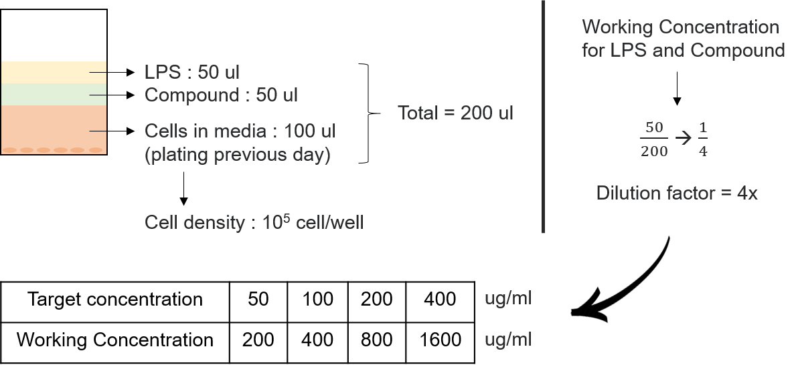
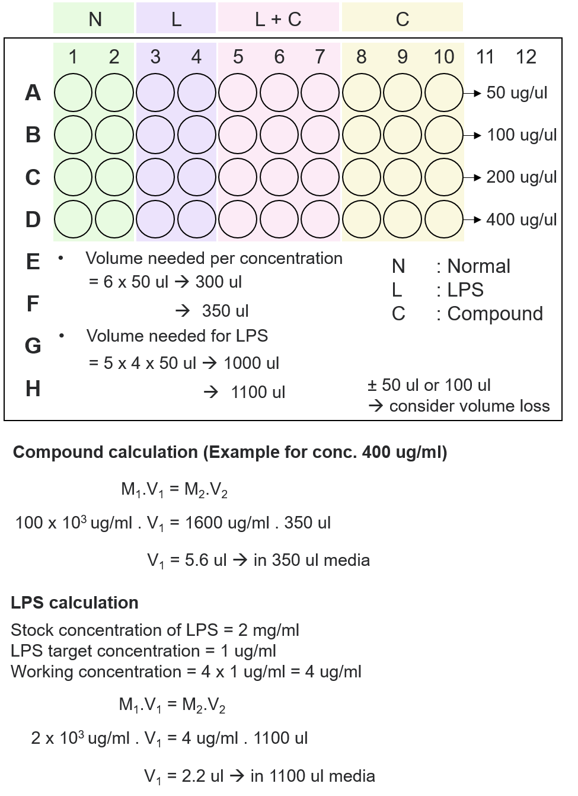

### Compound/Extract Preparation
* Extract = 16.42 mg/tube 
* Make stock 100 mg/ml --> add 0.1642 ml = 164 ul

```{r setup, out.width="60%",echo=FALSE, eval=TRUE}


```

```{r image2, out.width="55%",echo=FALSE, eval=TRUE}


```


---
### Treatment
* Compound/Extract pre-treatment 50 ul for 30 min
* LPS treatment 50 ul for 24 h

### NO measurement (Next day) and adding MTT solution
* Move supernatant (100 ul) to a new 96 well plate 
* Mix Griess reagent A and B (1:1) -> approximate volume needed
* Add mixed Griess reagent (100 ul/well) into 96 well plate containing supernatant
* Measure the absorbance (540 nm)
* Calculate the NO concentration according to NO standard curve